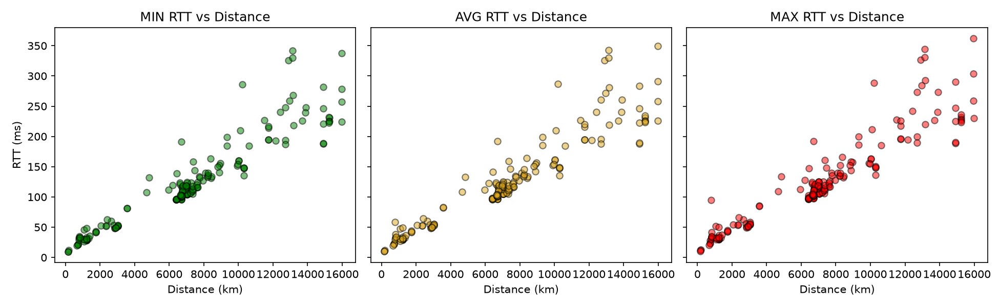

# CS 422 Assignment 1

**Setup Instructions**
1. Clone the repo
1. Navigate to the repo's top-level directory
1. Create and activate Python virtual environment<br>*python3 -m venv .venv*<br>*source .venv/bin/activate*
1. Install required packages<br>*pip install -r requirements.txt*

**TODO: need to combine scripts for both part 1 and part 2 into a single script. Maybe we can change script.sh to be the single script that handles venv, required packeges, and running both part's scripts?**

**Question 1** \
Script File: *part_1.py* \
Scatterplot: *rtt_vs_distance.pdf* \

**Question 2** \
Script File: \
Bar Chart: \
Scatterplot: \

---

## Report

GitHub repo: https://github.com/Asehr1/cs422-lab1

### Part 1: Ping Test and Round-Trip Time (RTT)

**Data collection.** For every IP in `listed_iperf3_servers.csv` (190 iperf3 servers), plus our own public IP,
we ran a ping test and looked up geolocation coordinates. See:
- Ping (min/avg/max RTT extraction) and geolocation lookup: [`ping.sh`](ping.sh)
- Distance calculation (haversine formula): [`part_1.py` lines 7-14](part_1.py#L7-L14)
- Scatter plot generation: [`part_1.py` lines 31-42](part_1.py#L31-L42)

Of the 191 hosts (190 servers + self), 187 responded to ping and 190 were geolocatable; 186 hosts
(including self) had both RTT and location data. Excluding self, the remaining 185 destination
servers are plotted below.

**Plot:** [`rtt_vs_distance.pdf`](rtt_vs_distance.pdf)



**Observations and explanation (1c).**

The delay at each hop along a path is:

```
nodal delay = processing delay + queuing delay + transmission delay + propagation delay
```

Of these four components, only propagation delay (distance / propagation speed) is fixed by geography.
It grows directly with physical path length. Queuing delay varies instead with how busy the routers
and links along the path are at the time of the measurement.

Distance and RTT increase together consistently across the dataset, with a correlation of about 0.93
for min, avg, and max alike. This is expected because propagation delay dominates the RTT and scales
with distance. The two closest servers (`185.93.1.65` and `chi.speedtest.clouvider.net`, both ~170 km
away) had min RTTs of 9.4-9.8 ms, while the farthest servers (~13,000-16,000 km away, e.g.
`197.227.12.18` and New Zealand's `linetest.nz` hosts) had min RTTs of 330-345 ms.

Min RTT is the sample with the least queuing delay, so it isolates propagation delay and tracks
distance most closely. If a host's min RTT is much higher than its distance alone would suggest, the
actual path taken is longer than the direct distance between the two locations, since propagation
delay accumulates over the real path length, not the map distance.

The spread between min and max RTT reflects queuing delay rather than distance, since propagation
delay is roughly constant for a fixed path. Most hosts had a small spread (median 1.7 ms), indicating
a stable network state. A few hosts stood out: `atl.speedtest.clouvider.net`, only 775 km away, had a
63 ms spread (min 32 ms, max 95 ms), a large spread despite short distance that points to a poor
network state along the path rather than a distance effect.

Overall, distance sets a floor on RTT through propagation delay, so min RTT is a good proxy for
distance, while the min-max spread is a proxy for the network state, independent of distance.
